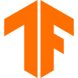
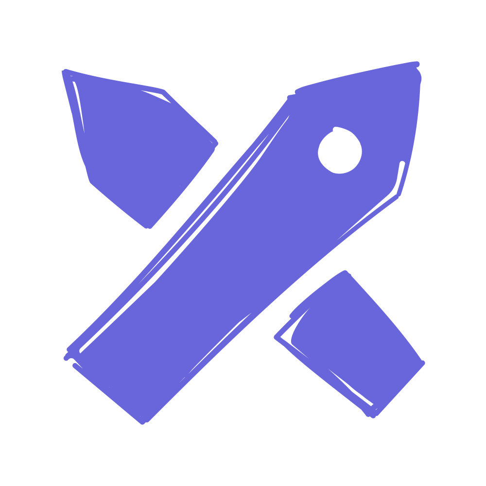
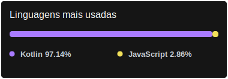

# 👋 Hello, World! I'm Gianluca Paz! 🌎

- Me chamo Gianluca do Nascimento Paz, sou Desenvolvedor de Software e vivo no Brasil.

- Tenho atuado principalmente em projetos de desenvolvimento mobile, construção de interfaces e aplicações web, 
   utilizando **Kotlin**, **Jetpack Compose**,  **HTML**, **CSS** e **JavaScript**.

- Busco aprofundar meus conhecimentos em **backend** e **IA aplicada**, como complemento à minha formação e aos projetos que desenvolvo.

- Também utilizo **Figma** para UI design e **Excalidraw** para organizar ideias, fluxos e protótipos visuais de forma mais dinâmica.

- Este é um espaço onde compartilho projetos, estudos e experimentos relacionados à minha evolução como desenvolvedor.

---

## 🚀 Projeto em destaque

### ♻️ RecycleApp

Aplicativo Android desenvolvido em grupo como projeto de TCC, com foco na classificação local de resíduos utilizando **Kotlin**, **Jetpack Compose** e **TensorFlow Lite**.

O projeto envolveu o desenvolvimento da interface, da lógica da aplicação, da integração com a câmera e a galeria, além da implementação de IA embarcada diretamente no dispositivo.

---

## 🤖 Ferramentas e Tecnologias

<table>
  <tr>
    <td align="center" width="72">Kotlin</td>
    <td align="center" width="72">Jetpack Compose</td>
    <td align="center" width="72">TensorFlow Lite</td>
    <td align="center" width="72">HTML</td>
    <td align="center" width="72">CSS</td>
    <td align="center" width="72">JavaScript</td>
    <td align="center" width="72">Python</td>
    <td align="center" width="72">Git</td>
    <td align="center" width="72">Figma</td>
    <td align="center" width="72">Excalidraw</td>
  </tr>
  <tr>
    <td align="center" valign="middle" width="72">
      
    </td>
    <td align="center" valign="middle" width="72">
      
    </td>
    <td align="center" valign="middle" width="72">
      
    </td>
    <td align="center" valign="middle" width="72">
      
    </td>
    <td align="center" valign="middle" width="72">
      
    </td>
    <td align="center" valign="middle" width="72">
      
    </td>
    <td align="center" valign="middle" width="72">
      
    </td>
    <td align="center" valign="middle" width="72">
      
    </td>
    <td align="center" valign="middle" width="72">
      
    </td>
    <td align="center" valign="middle" width="72">
      
    </td>
  </tr>
</table>

---

## 📊 Estatísticas

  
  

---

## ✉️ Redes e Contatos

  
  
  
  
     
  

<!-- Futuro Link do Whatsapp:
  
-->

<!-- Futuro Discord, se quiser transformar em link:

-->

---
