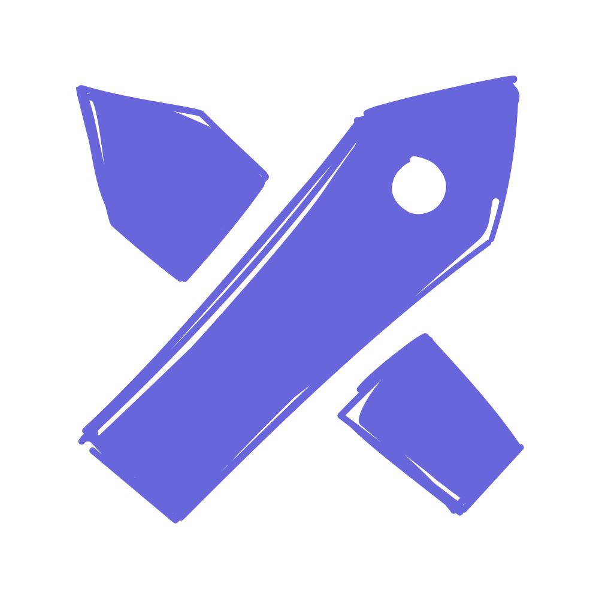

# 👋 Hello, World! I'm Gianluca Paz! 🌎

Me chamo **Gianluca do Nascimento Paz**, sou Desenvolvedor de Software baseado no Brasil.

Tenho atuado principalmente em projetos de **desenvolvimento mobile**, construção de **interfaces** e **aplicações web**, com foco em experiência do usuário e código bem estruturado - usando **Kotlin**, **Jetpack Compose**, **HTML**, **CSS** e **JavaScript**.

Também utilizo **Figma** para UI design e **Excalidraw** para organizar ideias, fluxos e protótipos visuais de forma mais dinâmica.

> 🌱 Atualmente aprofundando conhecimentos em **IA aplicada** (modelos TFLite embarcados), **backend com Cloud Firestore** e arquitetura limpa para Android, como parte do meu TCC e projetos em produção.

Este é um espaço onde compartilho projetos, estudos e experimentos relacionados à minha evolução como desenvolvedor.

---

## 🚀 Projeto em destaque

### ♻️ RecycleApp

Aplicativo Android desenvolvido como **Trabalho de Conclusão de Curso (TCC)**, com foco em educação ambiental e logística reversa na região metropolitana do Rio de Janeiro.

**O que o app faz:**
- 📸 **Classificação de resíduos por IA** - modelo de visão computacional rodando localmente no dispositivo via TensorFlow Lite, treinado para identificar materiais recicláveis (plástico, vidro, papel, metal) a partir de fotos da câmera ou galeria
- 🗺️ **Mapa interativo de pontos de coleta** - 153 pontos cadastrados (PEVs, Ecopontos, Light Recicla) em Rio de Janeiro, Niterói, São Gonçalo, Duque de Caxias e Angra dos Reis, com filtros por tipo e sistema de clustering
- 📚 **Conteúdo educativo** - telas sobre cores das lixeiras (CONAMA nº 275/2001), o que e como descartar, e glossário de termos da reciclagem
- 🏛️ **Programas de reciclagem** - guia dos programas municipais e estaduais da região (Recicla Niterói, Light Recicla, EcoCLIN, Recicla São Gonçalo e outros)

**Stack técnica:**
- **Android** - Kotlin, Jetpack Compose, Clean Architecture, Service Locator
- **IA embarcada** - TensorFlow Lite (classificador CNN/EfficientNet treinado em Python)
- **Backend** - Cloud Firestore com fallback em cache local e dados estáticos
- **Mapas** - Google Maps SDK + clustering via `maps-compose-utils`
- **Dados** - Script Python (`populate_firestore_v2.py`) para ingestão de dados municipais via planilhas Excel
- **Regulatório** - Conformidade com CONAMA nº 275/2001 e PNRS Lei nº 12.305/2010

**Link:**

---

## 🤖 Ferramentas e Tecnologias

<table>
  <tr>
    <td align="center" width="72">Kotlin</td>
    <td align="center" width="72">Jetpack Compose</td>
    <td align="center" width="72">TensorFlow Lite</td>
    <td align="center" width="72">HTML</td>
    <td align="center" width="72">CSS</td>
    <td align="center" width="72">JavaScript</td>
    <td align="center" width="72">Python</td>
    <td align="center" width="72">Git</td>
    <td align="center" width="72">Figma</td>
    <td align="center" width="72">Excalidraw</td>
  </tr>
  <tr>
    <td align="center" valign="middle" width="72">
      
    </td>
    <td align="center" valign="middle" width="72">
      
    </td>
    <td align="center" valign="middle" width="72">
      
    </td>
    <td align="center" valign="middle" width="72">
      
    </td>
    <td align="center" valign="middle" width="72">
      
    </td>
    <td align="center" valign="middle" width="72">
      
    </td>
    <td align="center" valign="middle" width="72">
      
    </td>
    <td align="center" valign="middle" width="72">
      
    </td>
    <td align="center" valign="middle" width="72">
      
    </td>
    <td align="center" valign="middle" width="72">
      
    </td>
  </tr>
</table>

---

## 📊 Estatísticas

  
  

---

## 📫 Redes e Contatos

  
  
  
  

<!-- Futuro Link do Whatsapp:
  
-->

<!-- Futuro Discord com link:

-->

---
